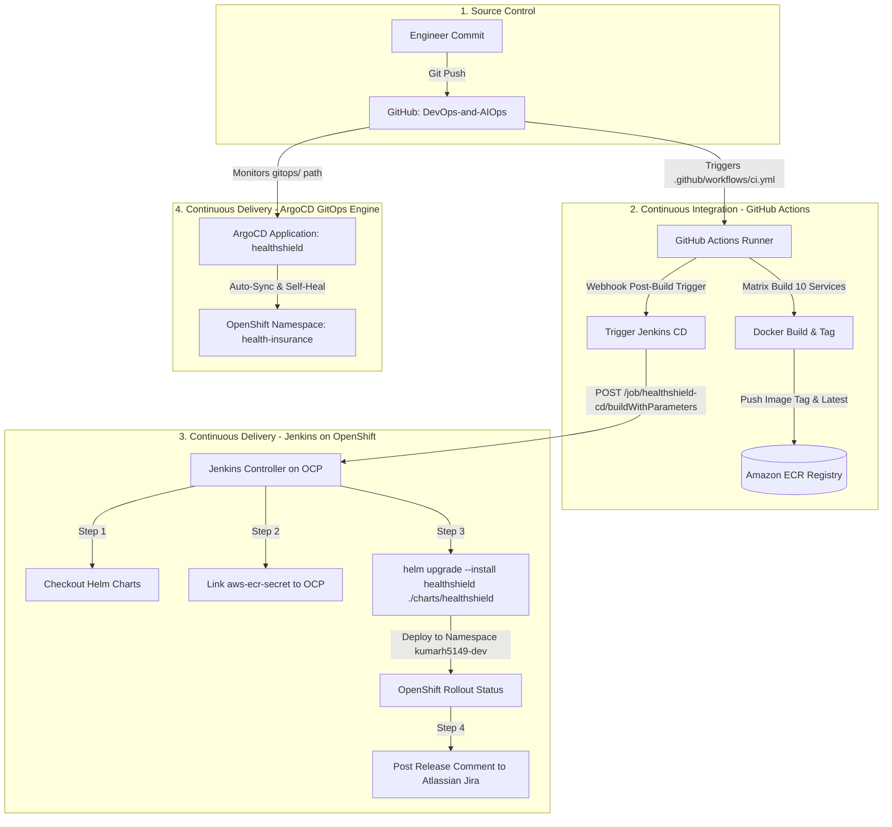

# HealthShield Enterprise: Complete Project Architecture & AIOps Guide
*An exhaustive reference guide for architecture, hybrid cloud operations, GitOps CI/CD pipelines, and Gemini-powered Multi-Agent AI orchestration.*

---

## 1. Architectural Foundations: Hybrid Cloud Strategy

HealthShield is designed as a **Production-Grade Hybrid Cloud Platform**. It decouples application compute from storage and container registries to achieve high reliability, regulatory compliance, and cost optimization ($0 unnecessary AWS compute charges):

```
┌──────────────────────────────────────────────────────────────────────────────────────────────────┐
│                                  HYBRID CLOUD ARCHITECTURAL TOPOLOGY                             │
├──────────────────────────────────────────────────┬───────────────────────────────────────────────┤
│    RED HAT OPENSHIFT CONTAINER PLATFORM (OCP)    │               AMAZON WEB SERVICES (AWS)       │
│               [Application Compute]              │              [Storage, IAM & Registry]        │
├──────────────────────────────────────────────────┼───────────────────────────────────────────────┤
│  • Microservices Compute (Pods, Deployments)     │  • Amazon ECR Container Registry              │
│  • Edge TLS Ingress (OpenShift Routes)           │    (794558722040.dkr.ecr.us-east-1...)        │
│  • PostgreSQL Multi-Database StatefulSet         │  • Amazon S3 Kafka Event Lakehouse            │
│  • Strimzi Apache Kafka Cluster (Port 9092)      │    (healthshield-kafka-events-794558722040)   │
│  • Jenkins CD Controller (healthshield-cd)       │  • Amazon S3 Encrypted Document Vault         │
│  • ArgoCD GitOps Engine (Namespace Sync)         │    (healthshield-documents-794558722040)      │
│  • Prometheus & Grafana Loki Observability       │  • AWS IAM Scoped Access Policies             │
│  • Multi-Agent AI Swarm (Port 3011 & 8501)       │    (Kafka S3 Sink & Document Service Roles)   │
└──────────────────────────────────────────────────┴───────────────────────────────────────────────┘
```

---

## 2. Microservices Catalog & Inter-Service Data Flow

The platform comprises **9 Express/TypeScript microservices**, a **React 18 frontend**, a **PostgreSQL relational tier**, and an **Apache Kafka event backbone**:

```
                                  ┌────────────────────────────────────────────────────────┐
                                  │           Unified React Web Portal (Port 3000)         │
                                  │      [👤 Customer]   [🏥 Hospital/TPA]   [⚙️ Claims]    │
                                  └───────────────────────────┬────────────────────────────┘
                                                              │ HTTPS (OpenShift Route)
                                                              ▼
                                                  ┌───────────────────────┐
                                                  │  API Gateway Service  │
                                                  │       Port 3001       │
                                                  │  (Reverse Proxy/CORS) │
                                                  └───────────┬───────────┘
                                                              │
         ┌────────────┬─────────────┬─────────────┬───────────┴─┬─────────────┬─────────────┬─────────────┐
         │            │             │             │             │             │             │             │
   ┌─────▼────┐ ┌─────▼─────┐ ┌─────▼─────┐ ┌─────▼─────┐ ┌─────▼─────┐ ┌─────▼─────┐ ┌─────▼─────┐ ┌─────▼─────┐
   │   Auth   │ │  Policy   │ │   Claim   │ │   Member  │ │  Hospital │ │  Billing  │ │ Document  │ │  Support  │
   │  & KYC   │ │ & Explain │ │  & PreAuth│ │  Service  │ │  Network  │ │ & Payments│ │ & Consent │ │ & JSM Desk│
   │ Port 3002│ │ Port 3003 │ │ Port 3004 │ │ Port 3005 │ │ Port 3008 │ │ Port 3006 │ │ Port 3009 │ │ Port 3010 │
   └─────┬────┘ └─────┬─────┘ └─────┬─────┘ └─────┬─────┘ └─────┬─────┘ └─────┬─────┘ └─────┬─────┘ └─────┬─────┘
         │            │             │             │             │             │             │             │
   ┌─────▼────┐ ┌─────▼─────┐ ┌─────▼─────┐ ┌─────▼─────┐ ┌─────▼─────┐ ┌─────▼─────┐ ┌─────▼─────┐ ┌─────▼─────┐
   │ auth_db  │ │policies_db│ │ claims_db │ │members_db │ │hospitals_db││billing_db ││documents_db││support_db  │
   └──────────┴─┴───────────┴─┴───────────┴─┴───────────┴─┴───────────┴─┴───────────┴─┴───────────┴─┴───────────┘
                                                              │
                                                 ┌────────────▼───────────┐
                                                 │ PostgreSQL (Port 5432) │
                                                 └────────────────────────┘
```

### Microservice Responsibility Matrix

1. **Frontend Portal (`frontend`, Port 3000)**: React 18 SPA serving Customer, Admin, Developer, QA, Hospital, and AIOps roles.
2. **API Gateway (`gateway`, Port 3001)**: Single entrypoint with reverse proxies, CORS control, helmet security headers, and Prometheus `/metrics`.
3. **Auth & KYC (`auth`, Port 3002)**: JWT issuance, bcrypt password hashing, Aadhaar/PAN mock verification, and role-based access control (RBAC).
4. **Policy Service (`policy-service`, Port 3003)**: Dynamic quote calculator, plain-language policy explanations, tier definitions (Bronze, Silver, Gold, Platinum), and policy proposal storage.
5. **Claim Service (`claim-service`, Port 3004)**: Cashless pre-authorizations, IPD/OPD reimbursement workflows, adjudicator workbench, and fraud scoring.
6. **Member Service (`member-service`, Port 3005)**: Subscriber records, dependent coverage profiles, and active policy bindings.
7. **Billing Service (`billing-service`, Port 3006)**: Payment gateway checkout (UPI/Card), idempotency key validation, Section 80D tax certificates, and Kafka event publisher.
8. **Hospital Service (`hospital-service`, Port 3008)**: Network hospital directory, city/geo specialty search, and emergency bed availability.
9. **Document Service (`document-service`, Port 3009)**: SHA-256 encrypted medical bill vault, IRDAI data consent tracking, and S3 integration.
10. **Support Service (`support-service`, Port 3010)**: Jira Service Management (JSM) REST API client, Atlassian issue tracking, and Grafana Loki log ingestion.

---

## 3. CI/CD & GitOps Machinery Explained

HealthShield utilizes a dual **GitOps CI + Jenkins & ArgoCD CD Pipeline**:



### Why Jenkins AND ArgoCD?
* **Jenkins CD (`Jenkinsfile`)**: Manages the imperatively driven deployment pipeline. It enforces automated gating, verifies image pull secrets, handles Helm releases, checks pod rollout health, and posts deployment audit comments to Jira Service Management.
* **ArgoCD (`gitops/argo-cd.yml`)**: Manages the declaratively driven GitOps state. It continuously compares the Git repository state (`gitops/`) with live OpenShift cluster state, preventing configuration drift and providing self-healing.

---

## 4. Red Hat OpenShift (OCP) Ingress & Networking

Instead of provisioning expensive cloud load balancers (such as AWS Application Load Balancers), HealthShield uses **OpenShift Routes** (`route.openshift.io/v1`):

* **Frontend Route (`healthshield-frontend-route`)**: Edge TLS termination redirecting HTTP $\rightarrow$ HTTPS on Port 443 directly to the frontend React service (Port 3000).
* **Gateway Route (`healthshield-gateway-route`)**: Edge TLS termination forwarding external API traffic, mobile requests, and webhooks to API Gateway (Port 3001).

---

## 5. The Gemini-Powered Multi-Agent AI System

The multi-agent system transforms HealthShield into an autonomous, self-healing, self-improving platform. It operates inside `aiops-assistant/` and exposes both a **headless FastAPI REST API (Port 3011)** and an **interactive Streamlit Console (Port 8501)**, as well as an embedded React Console in the frontend:

```
                                    ┌────────────────────────────────────────────────────────┐
                                    │               Apex Supervisor Agent                    │
                                    │         (Intent Classifier & Task Router)              │
                                    └───────────────┬────────────────────────┬───────────────┘
                                                    │                        │
                    ┌───────────────────────────────┴────────┐      ┌────────┴───────────────────────────────┐
                    ▼                                        ▼      ▼                                        ▼
    ┌───────────────────────────────┐        ┌──────────────────────────────┐        ┌──────────────────────────────┐
    │     Platform & SRE Agents     │        │      DevOps & Data Agents    │        │       Business Domain Agents │
    │ ───────────────────────────── │        │ ──────────────────────────── │        │ ──────────────────────────── │
    │ 🔍 SRE Diagnostics (Kira)     │        │ 🛠️ Auto-Remediation Operator │        │ 💡 NEXUS: Innovation & Growth│
    │ 🗄️ Database Reliability (DBA)│        │ 🚀 CI/CD & GitOps Agent      │        │ 📋 Claims & Fraud Adjudicator│
    └───────────────────────────────┘        └──────────────────────────────┘        └──────────────────────────────┘
```

### Agent Roles & Work Scope

| Agent | Core Responsibilities | Data Sources & Tools |
| :--- | :--- | :--- |
| **👑 Apex Supervisor** | Classifies incoming developer/ops requests; dispatches tasks to specialized sub-agents; synthesizes cross-domain answers; enforces permissions. | Shared State Graph, Gemini 2.5 / 3.x Flash/Pro |
| **🔍 Kira (SRE Diagnostics)** | Monitors microservice health, parses Prometheus metrics (QPS, P95 latency, 5xx error rates), checks OpenShift pods, and performs Root Cause Analysis (RCA). | Prometheus PromQL, OpenShift Health endpoints, CloudWatch/Loki |
| **🛠️ Operator (Remediation)** | Executes safe self-healing actions: rolling restarts on unhealthy pods, scaling replica sets, clearing stale caches, and proposing rollbacks. | OpenShift API (`oc rollout restart`, `oc scale`), Helm rollback |
| **💡 Nexus (Innovation & Growth)** | Analyzes customer drop-off data in `members_db` and `billing_db`; researches competitor insurance offerings; formulates new policy packages (e.g., OPD dental, micro-insurance); tests ideas with synthetic personas; pushes approved policies to `policy-service`. | Web Search / Market Intel, Text-to-SQL, Synthetic Persona Swarm, Policy Service API |
| **📋 Adjudicator (Claims)** | Performs AI medical necessity checks, verifies hospital discharge bills against policy waiting periods, and runs AI fraud risk scoring. | Document Vault hashes, Policy rules, Claims DB, Gemini Multimodal vision |

---

## 6. Action Safety & Governance (Human-in-the-Loop)

To guarantee stability in production OpenShift environments, all agent actions follow **3 Action Tiers**:

* **Tier 0 (Read-Only — 100% Autonomous)**:
  * Prometheus telemetry queries, pod status inspection, log analysis, customer demographic analytics, policy comparisons.
* **Tier 1 (Safe Self-Healing — Autonomous with Audit)**:
  * Restarting a crash-looping pod, scaling pods within safe boundaries (`min: 2, max: 8`), auto-replying to common support inquiries.
* **Tier 2 (High Impact — Requires Human-in-the-Loop Approval)**:
  * Helm release rollbacks, database schema modifications, launching new insurance policies into the production catalog, paying out claims above financial limits.
  * *Workflow*: Agent creates a structured `AgentProposal` $\rightarrow$ appears in the **Governance Inbox** of the UI $\rightarrow$ Engineer clicks **[Approve]** or **[Reject]**.

---

## 7. How the Multi-Agent System Hooks into the Ecosystem

1. **OpenShift Cluster Integration**:
   * The agent runs as an OpenShift native pod inside namespace `kumarh5149-dev` or `health-insurance`.
   * Queries OpenShift Prometheus (`http://prometheus:9090`) and OpenShift service endpoints via Kubernetes DNS.
2. **AWS Cloud Integration**:
   * Inspects S3 document checksums stored in `healthshield-documents-794558722040`.
   * Verifies ECR image digests during CI/CD checks.
3. **Jenkins & ArgoCD Integration**:
   * Queries Jenkins build status (`/job/healthshield-cd/api/json`) to report on pipeline failures.
   * Checks ArgoCD sync status to identify cluster configuration drift.
4. **PostgreSQL Multi-Database Integration**:
   * Connects to `policies_db`, `members_db`, and `billing_db` to perform real-time conversion and demographic analytics for the Nexus Innovation Agent.
5. **API Gateway Integration**:
   * Reverse proxied through `gateway:3001/api/agents` and `/api/aiops` so external callers and the React frontend can seamlessly interact with the agent swarm.

---

## 8. Essential Commands & Runbook

### OpenShift Operations
```bash
# Check all deployments and routes in dev namespace
oc get all -n kumarh5149-dev

# View pod logs
oc logs -f deployment/gateway -n kumarh5149-dev
oc logs -f deployment/claim-service -n kumarh5149-dev

# Manual rollout restart if needed
oc rollout restart deployment/gateway -n kumarh5149-dev
```

### Helm Deployment Operations
```bash
# Dry run template validation
helm template healthshield ./charts/healthshield --namespace kumarh5149-dev

# Upgrade/install release
helm upgrade --install healthshield ./charts/healthshield \
  --namespace kumarh5149-dev \
  --set global.imageTag=latest

# Check release history
helm history healthshield -n kumarh5149-dev
```

### Local Multi-Agent Testing
```bash
cd aiops-assistant

# Start FastAPI Agent Backend (Port 3011)
python3 server.py

# Start Streamlit Multi-Agent Console (Port 8501)
streamlit run app.py
```

---

## 7. Autonomous Jira Ticket-Driven Operations & Worker Daemon

In HealthShield Enterprise, **Atlassian Jira Service Management (JSM)** serves as the single source of operational truth and governance audit trail:

### 1. Mandatory Ticket Governance Policy
* **Zero Un-audited Changes**: Every action—whether adding a Kafka topic, updating replica counts, executing pod rolling restarts, or publishing newly formulated insurance policies—must be linked to and backed by a Jira ticket (IssueType `10004` [Task] or `10001` [Service Request]).
* **Automated Incident Lifecycle**: When Prometheus alerts trigger or Kira SRE detects 5xx error spikes or pod crash loops, Kira automatically opens an Incident ticket (IssueType `10003`), appends the Google Gemini Root Cause Analysis (RCA), and Operator resolves it once the cluster is verified healthy.

### 2. Autonomous Jira Swarm Worker Daemon (`tools/jira_worker.py`)
Rather than requiring engineers to manually click buttons, the Swarm runs an autonomous background worker thread (`start_jira_worker_daemon`) that actively monitors Jira Cloud:

```
                      ┌──────────────────────────────────────┐
                      │    Jira Cloud (Project: OPS)         │
                      │  https://kumarh5149.atlassian.net    │
                      └──────────────────┬───────────────────┘
                                         │
                         [30s Poll or Webhook Event]
                                         │
                                         ▼
                      ┌──────────────────────────────────────┐
                      │    Autonomous Jira Swarm Worker      │
                      │      (tools/jira_worker.py)          │
                      └──────────────────┬───────────────────┘
                                         │
             ┌───────────────────────────┼───────────────────────────┐
             ▼                           ▼                           ▼
┌─────────────────────────┐ ┌─────────────────────────┐ ┌─────────────────────────┐
│ 1. Acknowledge & Pick Up│ │ 2. Dispatch & Execute   │ │ 3. Audit & Auto-Resolve │
│ Transition: 'In Progress│ │ Apex routes to domain:   │ │ Posts technical logs;   │
│ Appends assigned note   │ │ - Kafka provisioning    │ │ Transition: 'Done' /    │
│                         │ │ - SRE RCA diagnostics   │ │ 'Completed'             │
│                         │ │ - Cluster remediation   │ │                         │
└─────────────────────────┘ └─────────────────────────┘ └─────────────────────────┘
```

### 3. Live Verified Operations
* **OPS-2**: P1 Incident for `claim-service` 503 latency spike — Diagnosed by Kira, resolved by Operator.
* **OPS-3**: Policy service database connection timeout — Handled and resolved.
* **OPS-4**: Automated Kafka Topic `underwriting.events` Onboarding — Provisioned in Strimzi and marked Done.
* **OPS-5**: Kafka Topic `analytics.events` Onboarding — Provisioned and marked Done.
* **OPS-7 & OPS-8**: Background Daemon Autonomous Ticket Intake — Provisioned `audit.events` and marked Done.
* **OPS-9**: Dead-Letter-Queue `claim.dlq.events` Onboarding — Full automated intake, Strimzi CR committed to GitOps (`02-kafka-topics.yml`), and marked Done in Jira Cloud.

